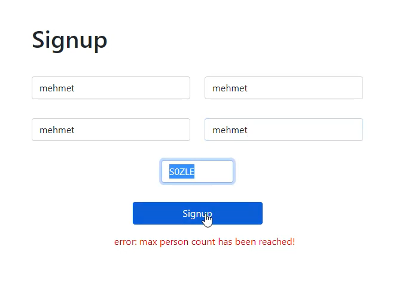

# Spring Boot Referral Code Project

How can we invite our friends with using referral code basically?
Answer of this question in this repo :)

- Spring Boot
- Exception Handling
- Validation
- H2 Database


## Example Images





## API Reference

#### Base API: http://localhost:8080


- #### Get user by username

```http
  GET /api/user/username/{username}
```
#### Response:
```javascript
{
    "id": 1,
    "username": "grkn",
    "name": "gurkan",
    "surname": "surname",
    "mail": "grkn@mail",
    "referralCode": "AJWZN",
    "referredByCode": null
}
```
##


- #### Get all by referral code

```http
  GET /api/user/{code}
```
#### Response:
```javascript
[
    {
        "id": 2,
        "username": "ahmet",
        "referralCode": "TQP2S",
        "name": "ahmet",
        "surname": "a",
        "mail": "ahmet@mail"
    },
    {
        "id": 3,
        "username": "mehmet",
        "referralCode": "G537P",
        "name": "mehmet",
        "surname":  "m",
        "mail":  "mehmet@mail"
    }
]
```
##

- #### Create user using referral code

```http
  POST /api/user
```

| Parameter | Type     | Description                       |
| :-------- | :------- | :-------------------------------- |
| `username`      | `string` | **Required**. username |
| `name`      | `string` | **Required**. name |
| `referredByCode`| `string` | **Required**. referralCode |
| `surname`      | `string` |  surname |
| `mail`      | `string` |  mail |

#### Request:
```javascript
{
    "username":"ertm",
    "name":"ertem",
    "referredByCode": "AJWZN"
}
```

#### Response:
```javascript
{
    "id": 2,
    "username": "ertm",
    "name": "ertem",
    "surname": null,
    "mail": null,
    "referralCode": "EFJNM",
    "referredByCode": "AJWZN"
}
```

## Installation

- #### Clone

```bash
  git clone https://github.com/gurkanucar/Spring-Boot-Referral-System.git
```

- #### run backend

```bash
  cd ./referral-be

  mvn spring-boot:run
```
    

- #### run frontend

```bash
  cd ./referral-fe

  npm Install

  npm start

```
    
